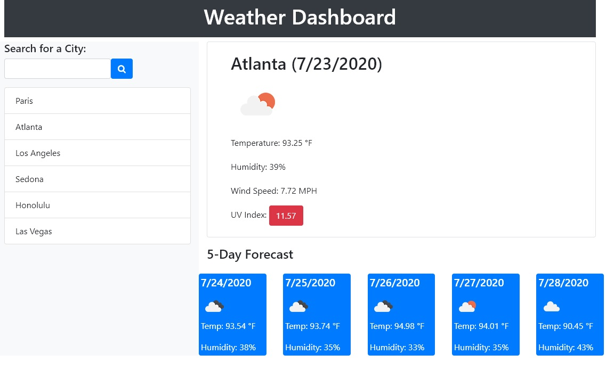

# Weather Dashboard

In this app, the user inputs a city anywhere in the world, then the app will render real-time weather data for that respective city. It then appends the inputted city into the search history list, while saving it to local storage. When the user pulls up the app again, they see all the previous cities they have entered. An interesting feature: when the UV Index is higher than 11 for the current day, the container that data is in will turn red. Naturally, this is to emphasize the natural danger of a high UV Index. 

## Error Handling:

If the user inadvertently inputs an invalid city, the user will be alerted of such event. The jQuery logic will also prevent that invalid input from being appended to the list and saved to local storage. If the user inputs a city that has already been inputted, then said city will move to the top of the search history list. 

## Link to the Program:

[Weather Dashboard](https://jacobhoss.github.io/weather-dashboard/)

## Demo Image:

